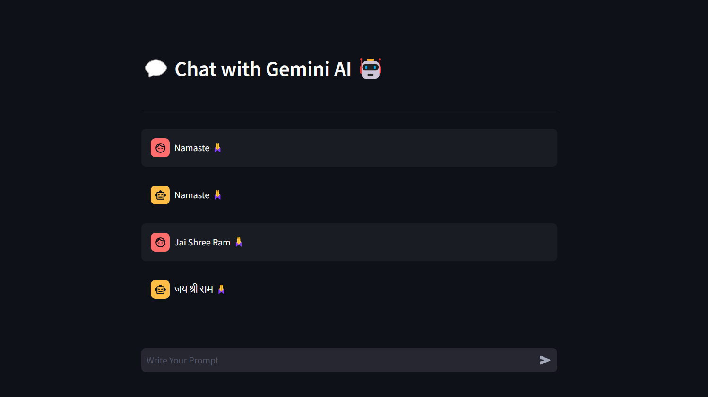

## Gemini AI Chat with Streamlit

This project utilizes Streamlit to create a simple chat interface with Gemini AI. Gemini AI is a generative model developed by Google for conversational purposes. Users can interact with the AI by inputting prompts and receiving responses.



### Setup

To run the application, follow these steps:

1. Install the necessary dependencies:
   ```bash
   pip install -r requirements.txt
   ```

2. Obtain your Gemini API key from [Google AI Studio](https://aistudio.google.com/app/apikey) and set it in the sidebar of the application.

3. Run the Streamlit app using the following command:
   ```bash
   streamlit run main.py
   ```

### Usage

Once the application is running, you'll see a chat interface where you can input prompts. Type your prompt in the input box and press Enter. The AI model will generate a response based on your prompt.

### Features

- **Simple Interface**: The chat interface allows users to interact with Gemini AI seamlessly.
- **Chat History**: The application keeps track of the conversation history, displaying both user prompts and AI responses.
- **Customizable Prompt**: Users can input their own prompts to generate responses from the AI.

### Code Overview

The main components of the code include:

- **Streamlit Setup**: Setting up the Streamlit application, including the UI elements and configuration for Gemini API.
- **Function to Gemini Model**: Interaction with the Gemini AI model to generate responses based on user prompts.
- **Main Function**: Handles user input, generates AI responses, and displays the conversation history in the chat interface.

### Credits

This project utilizes the Gemini AI model developed by Google. Streamlit is used for creating the user interface.

### License

This project is licensed under the [MIT License](https://opensource.org/license/mit).

### Disclaimer

Gemini AI is a product of Google and is provided as-is. Usage of Gemini AI may be subject to Google's terms and conditions. Please refer to Google's documentation for more information.

## Created By 
- Surya Pratap
- [Linkedin](https://www.linkedin.com/in/surya-pratap-871b95187/)
- [Github](https://github.com/SP85691)